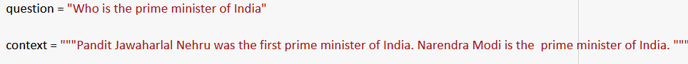

# BERT based Question Answering Model utilising Wikipedia pages as context 

The model uses BERT to find the span of an answer for given question and context pairs. 

<h4>Consider a sample question below:</h4>

The question along with the context is passed as input to BERT model, which then returns two integer values denoting the starting index and ending index for the possible answer in the given context.

<h3>What is answer_start_score and answer_end_scores</h3>
Here, for an answer span, <code>answer_start_scores</code> and <code>answer_end_scores</code> contains the log likelihood of each word being the starting word and ending word for the answer span.
<h4><code>start_scores</code> for the given question</h4>

<h4><code>end_scores</code> for the given question</h4>

<h3>How to select the answer span?</h3>
We select the maximum of all the possible values in <code>answer_start_scores</code> as the starting index for the answer span ans similarly we select the maximum of all values in <code>answer_end_scores</code> as the ending index for the answer span.
<h4>The answer for the given sample question is retrieved as follows:</h4>

<h2>Is there a way to get the answer without providing the context?</h2>
We'll try to retrieve the wikipedia documents based on the user's qeury.

<h3>How the documents are retrieved</h3>
Based on the question given by the user, the model first tries to fetch top 10 documents from the Wikipedia using Wiki library in Python. Among the 10 documents only first 2 are used as the context to find the answer.

<h4>A sample question for which documents are retrieved</h4>
The question is same as the previous one, except the part that now no context is provided by the user.

<h3>But the length of the wikipedia article is greater than token limit!</h3>
The BERT model can't have input length(question + context) greater than 512 tokens. Hence, the Wikipedia documents retrieved are broken into chunks of maximum 512 length and then each chunk is sequentially fed to the model as context along with the question.

<h3>Length of each chunk</h3>
Each document will have <i>n</i> answers where <i>n</i> is the number of chunks(roughly equals <b>ceil(<i>l</i>/(512 - <i>q</i>))</b>, where <i>l</i> = length of Wikipedia article, <i>q</i> = length of th question) for that particular document. 

<h3>More than one answers returned by a single document</h3>
Each Wikipedia document returns <i>n</i> number of answers where <i>n</i>i is the number of chunks it was divided in.
<h4>A sample question for which a single document returns more than one answer</h4>

<h4>The Final model returns answer as follows:</h4>

<h3>One specific best answer from all the chunks for a particular document</h3>
For each chunk, the <code>max_start_score</code> and <code>max_end_score</code> is calculated. Now, the sum of <code>max_start_score</code> and <code>max_end_score</code>/ is calculated and the chunk with the maximum sum is considered to offer the best possible answer.

<h3>The Final Model</h3>
The Final model which returns only 2 answers, one each from the top two documents fetched.
<h4>The below snap shows the way final model works</h4>

